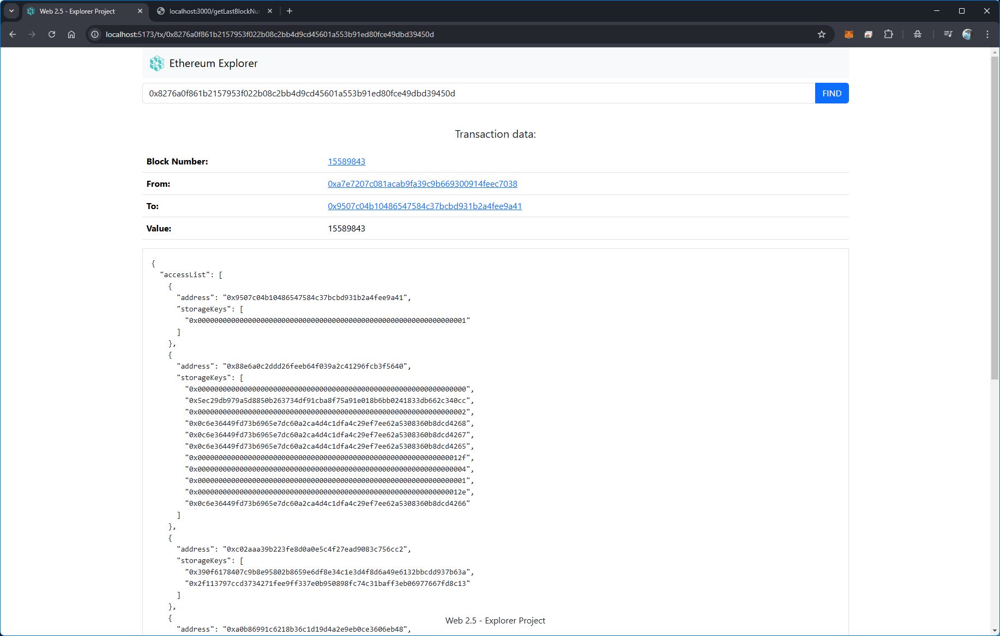
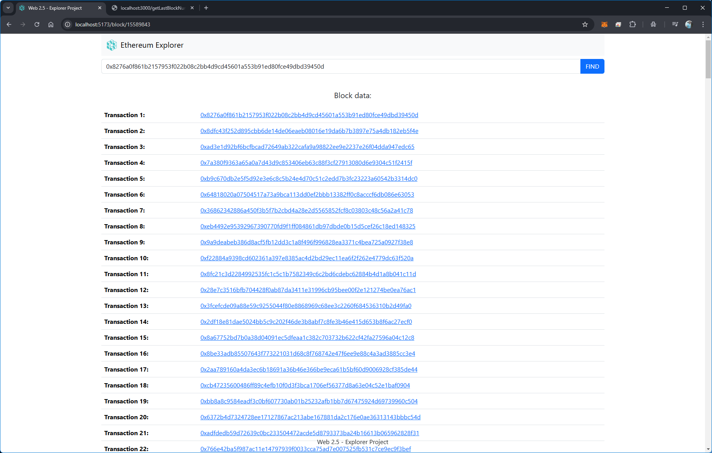
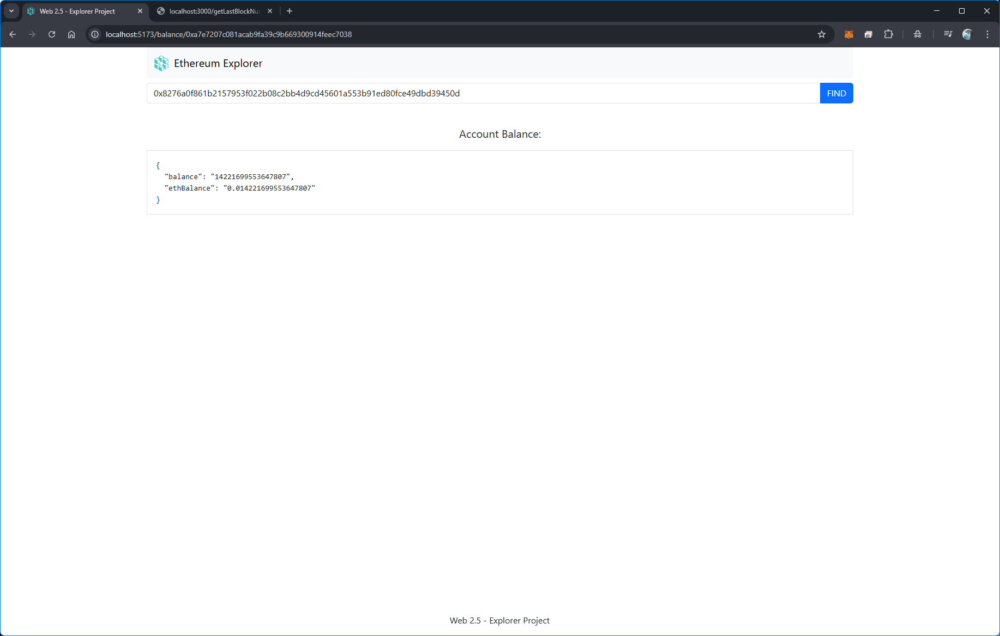

# Web 2.5 - Explorer Project 

## BackEnd: NodeJS + Typescript + Express
Created a NodeJS + Typescript + Express backend: 

### Installation:
```
npm init -y
npx tsc --init
git -init
npm i express
npm i @types/express
```

### Development: 

Created the three main endpoints: 

- `/getLastBlockNumber`
Response: 
```JSON
{
  "blockNumber": 21865044
}
```

- `/getBlockData/:blockNumber`
Response: 
```JSON
{
  "baseFeePerGas": "885981518",
  "blobGasUsed": "0",
  "difficulty": "0",
  "excessBlobGas": "76808192",
  "extraData": "0x546974616e2028746974616e6275696c6465722e78797a29",
  "gasLimit": "35894605",
  "gasUsed": "14619860",
  "hash": "0x7887f2eafde136ab939086db9637dff9e6f1999fa5bd4c62a6dec85dfda7d116",
  "logsBloom": "0xbd61e54b58697254f51844c6e2c3fb68599a63634c50600006d39800de93a9843e1db188e54c908a860ef82742c753a40293ca5faa6b6c8417f057ca4dad0a84b06336bb4e54098f7f7b756aaa5521fc2c35fc7b8456cd4a46024d1ac141ca064e035126da7e03aded2990b36862782da0f985f7d95005281a6123b707ed6a370e3d9ad923f893282c79b6ef233a04271401f343c19feb88eef768f24ff502ff0aea21d3f1fe7d1c1efe58e6b9c794da2dad1b5dcc5c584c5085427a0645b8e234031553a2080a7a33b3cc9ecd3b18c8156d2cbfa463b31087c17d0bae1a38d20033bed08ca36339448623b3f38cd2b1e388b30c29b932ceb881a02964595d07",
  "miner": "0x4838b106fce9647bdf1e7877bf73ce8b0bad5f97",
  "mixHash": "0x2aea6658bd0f3ba98522b2b1cad9693bee81a3a10136e82ff7c6314c1e9e45db",
  "nonce": "0",
  "number": "21865044",
  "parentBeaconBlockRoot": "0x82b503d8d2097ee3003bcff9ba82d8fe8f75fa7acf6f1c9f1d6ad98e6d2090f6",
  "parentHash": "0xbbb21e803679aebe9f43d2d81a728c8dcb891ab78a122c4719848311c3d9e7f2",
  "receiptsRoot": "0x19b5c1f59342646d660ae625cb335b2ccb6d33ad6cead43ba84822a0925cd620",
  "sha3Uncles": "0x1dcc4de8dec75d7aab85b567b6ccd41ad312451b948a7413f0a142fd40d49347",
  "size": "76015",
  "stateRoot": "0xf0d3233794bf7eb914c2e99b023f9b443ac9a774481c3ade54db80f1dd636007",
  "timestamp": "1739782571",
  "transactions": [
    "0x3e0f0135692163be48364027568083fa9738b2581c825cade26c17785ef52214",
    "0xa72564bf61d2a84060cdafd4c6aa03cd89c40002c86a46d476f3549057d1e76f",
    "0x40d96078b098c7f48d26181d58cd86dfedb1481e9b96afaba18eaf1ada371d84",
    "0x7b0791d44c410b0154a58bcc1b0378dface4321e5f2d63a89f9bf4ab31b854c3"
  ],
  "transactionsRoot": "0x87dc2c43a971e08d672ec9fd60a4962dc33920b56f7e959549c02876af5b42ef",
  "uncles": [],
  "withdrawals": [
    {
      "address": "0xb9d7934878b5fb9610b3fe8a5e441e8fad7e293f",
      "amount": "19234289",
      "index": "77281323",
      "validatorIndex": "718114"
    },
    {
      "address": "0xb9d7934878b5fb9610b3fe8a5e441e8fad7e293f",
      "amount": "19257385",
      "index": "77281324",
      "validatorIndex": "718115"
    },
    {
      "address": "0xb9d7934878b5fb9610b3fe8a5e441e8fad7e293f",
      "amount": "19261496",
      "index": "77281325",
      "validatorIndex": "718116"
    },
    {
      "address": "0xb9d7934878b5fb9610b3fe8a5e441e8fad7e293f",
      "amount": "19250328",
      "index": "77281326",
      "validatorIndex": "718117"
    },
    {
      "address": "0xb9d7934878b5fb9610b3fe8a5e441e8fad7e293f",
      "amount": "19220110",
      "index": "77281327",
      "validatorIndex": "718118"
    },
    {
      "address": "0xb9d7934878b5fb9610b3fe8a5e441e8fad7e293f",
      "amount": "19213959",
      "index": "77281328",
      "validatorIndex": "718119"
    },
    {
      "address": "0xb9d7934878b5fb9610b3fe8a5e441e8fad7e293f",
      "amount": "19202117",
      "index": "77281329",
      "validatorIndex": "718120"
    },
    {
      "address": "0xb9d7934878b5fb9610b3fe8a5e441e8fad7e293f",
      "amount": "19158587",
      "index": "77281330",
      "validatorIndex": "718121"
    },
    {
      "address": "0xb9d7934878b5fb9610b3fe8a5e441e8fad7e293f",
      "amount": "19177291",
      "index": "77281331",
      "validatorIndex": "718122"
    },
    {
      "address": "0xb9d7934878b5fb9610b3fe8a5e441e8fad7e293f",
      "amount": "19163361",
      "index": "77281332",
      "validatorIndex": "718123"
    },
    {
      "address": "0xb9d7934878b5fb9610b3fe8a5e441e8fad7e293f",
      "amount": "19156145",
      "index": "77281333",
      "validatorIndex": "718124"
    },
    {
      "address": "0xb9d7934878b5fb9610b3fe8a5e441e8fad7e293f",
      "amount": "19220894",
      "index": "77281334",
      "validatorIndex": "718125"
    },
    {
      "address": "0xb9d7934878b5fb9610b3fe8a5e441e8fad7e293f",
      "amount": "19103838",
      "index": "77281335",
      "validatorIndex": "718133"
    },
    {
      "address": "0xb9d7934878b5fb9610b3fe8a5e441e8fad7e293f",
      "amount": "19131738",
      "index": "77281336",
      "validatorIndex": "718134"
    },
    {
      "address": "0xb9d7934878b5fb9610b3fe8a5e441e8fad7e293f",
      "amount": "19133083",
      "index": "77281337",
      "validatorIndex": "718135"
    },
    {
      "address": "0xb9d7934878b5fb9610b3fe8a5e441e8fad7e293f",
      "amount": "64875067",
      "index": "77281338",
      "validatorIndex": "718136"
    }
  ],
  "withdrawalsRoot": "0x0d4168a62c173ec1bdfa29c4a2170843c189de81e625bd6b1a061ecfaf3bfa2f"
}
```

- `/getTxData/:txAddress` 
```JSON
{
  "accessList": [
    {
      "address": "0x98c3d3183c4b8a650614ad179a1a98be0a8d6b8e",
      "storageKeys": [
        "0x798ccbe29346a5fbfd5a444781e94d0e404758abd7e34bbd55822bd2969d23c3",
        "0x5a708b01fdd04de03217a845edc205cb78aa4de908f15a98ca793f6f1db4f594",
        "0x5a708b01fdd04de03217a845edc205cb78aa4de908f15a98ca793f6f1db4f595"
      ]
    },
    {
      "address": "0xc3db44adc1fcdfd5671f555236eae49f4a8eea18",
      "storageKeys": [
        "0x9b637a02e6f8cc8aa1e3935c0b27bde663b11428c7707039634076a3fb8a0c48",
        "0x000000000000000000000000000000000000000000000000000000000000011e",
        "0x000000000000000000000000000000000000000000000000000000000000011f",
        "0x0000000000000000000000000000000000000000000000000000000000000000",
        "0x0000000000000000000000000000000000000000000000000000000000000004",
        "0x0000000000000000000000000000000000000000000000000000000000000002"
      ]
    },
    {
      "address": "0x57e114b691db790c35207b2e685d4a43181e6061",
      "storageKeys": [
        "0x97c61cf25a75e9ae063e7f086838f5736319e97f8e04cdbe66d8130ec48cfa79",
        "0x46ed70dff4e88de7d66e6571d3936721e1c2e255e7f2b669fb59a70439131f38"
      ]
    },
    {
      "address": "0xc02aaa39b223fe8d0a0e5c4f27ead9083c756cc2",
      "storageKeys": [
        "0x828d961e33c5d8c110d40025a0c470038f9143adb9df2526f11234503cd86a90",
        "0x993460b7a842a34c6de2dc08dde1c527f4354825432b190bba2e4f8a7b04c6c8"
      ]
    }
  ],
  "blockHash": "0x7887f2eafde136ab939086db9637dff9e6f1999fa5bd4c62a6dec85dfda7d116",
  "blockNumber": "21865044",
  "chainId": "1",
  "from": "0x91aae0aafd9d2d730111b395c6871f248d7bd728",
  "gas": "500003",
  "gasPrice": "68607894367",
  "hash": "0x3e0f0135692163be48364027568083fa9738b2581c825cade26c17785ef52214",
  "input": "0x49c36c07000000000000000000000000e42318ea3b998e8355a3da364eb9d48ec725eb45000000000000000000000000000000000000000000000018f005c2430cb6fcdd000000000000000000000000000000000000001249994a162bdf000000000000000000000000000000000000000000000000001293baa08d948d0000000000000000000000000000000000000000000000000000000000000000000000000000",
  "maxFeePerGas": "68847109376",
  "maxPriorityFeePerGas": "67721912849",
  "nonce": "1132572",
  "r": "0x1efffdde52a5689126937cdfcd214fbc612f22da1600cd49b5acb49cc3819e77",
  "s": "0x72bd3c8e435c6bb6086f4bd09a9b1b8b5228f055af503786ff2a1f7b6d42f427",
  "to": "0x98c3d3183c4b8a650614ad179a1a98be0a8d6b8e",
  "transactionIndex": "0",
  "type": "2",
  "v": "1",
  "value": "0",
  "data": "0x49c36c07000000000000000000000000e42318ea3b998e8355a3da364eb9d48ec725eb45000000000000000000000000000000000000000000000018f005c2430cb6fcdd000000000000000000000000000000000000001249994a162bdf000000000000000000000000000000000000000000000000001293baa08d948d0000000000000000000000000000000000000000000000000000000000000000000000000000"
}
```

## FrontEnd: ViteJS
Created a Vite project: 
```
  npm create vite@latest
```

### Components

Created some layout and functional components: 

- Home 
- Header
- Footer
- Balance
- Block 
- Transacction

React libraries used: 

- React Hook Forms
- React Router
- Tanstack React Query

## Screenshots








## Platform: Infura.IO // QuickNode.com
Created an Infura account and an API Key. 

https://developer.metamask.io/
https://docs.metamask.io/services/reference/ethereum/quickstart/

https://dashboard.quicknode.com/
https://etherscan.io/
