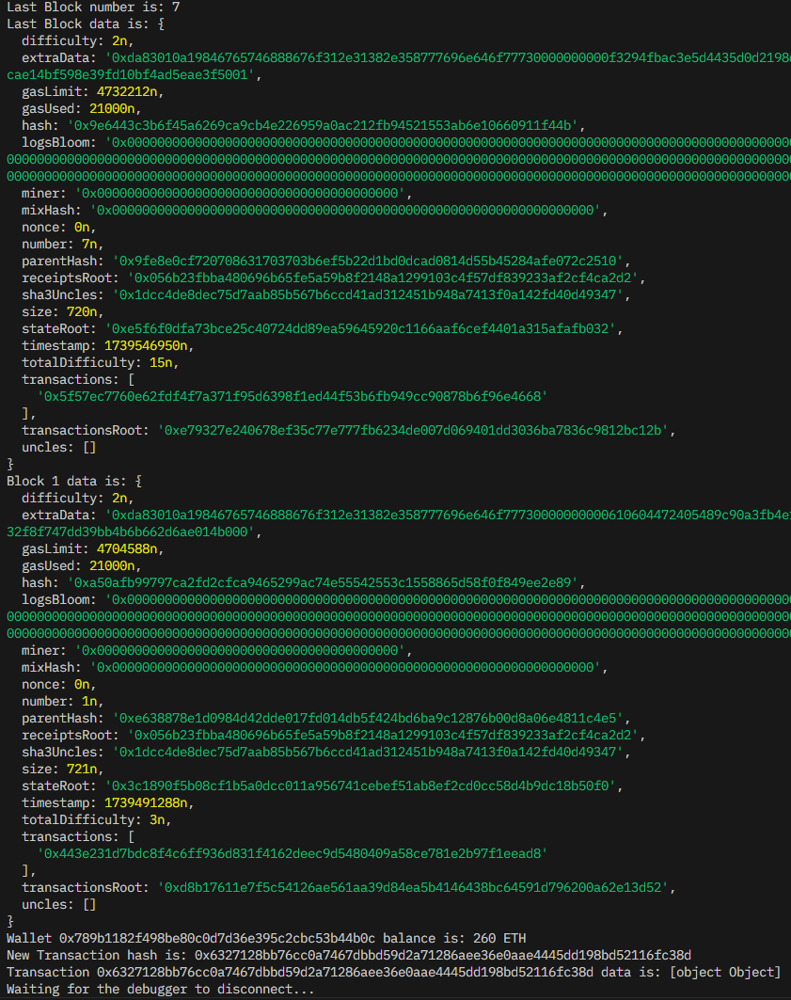
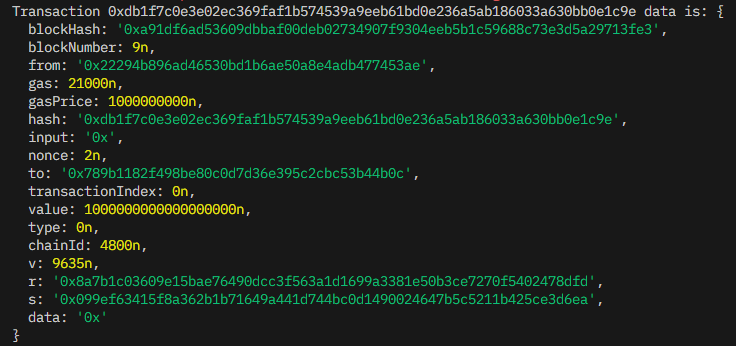

# Local Ethereum DLT Testing

## NodeJS + Typescript + Web3

### Installation
```
npm i
```
### Launch
_**Before starting this app we must launch Eth Local DLT**_
```
npm start
```
### Routine & result 
1. Get last block number
2. Get last block data
3. Get block by number (2)
4. Get wallet balance
5. Send Transaction 
6. Get transaction data

Console log screenshot:




### Utilitiy

I also have a function to reveal an account private key if you know it's password and have access to node's keystore.

I use it to reveal node1, account 1 private key an use `sendSignedTransaction`.
