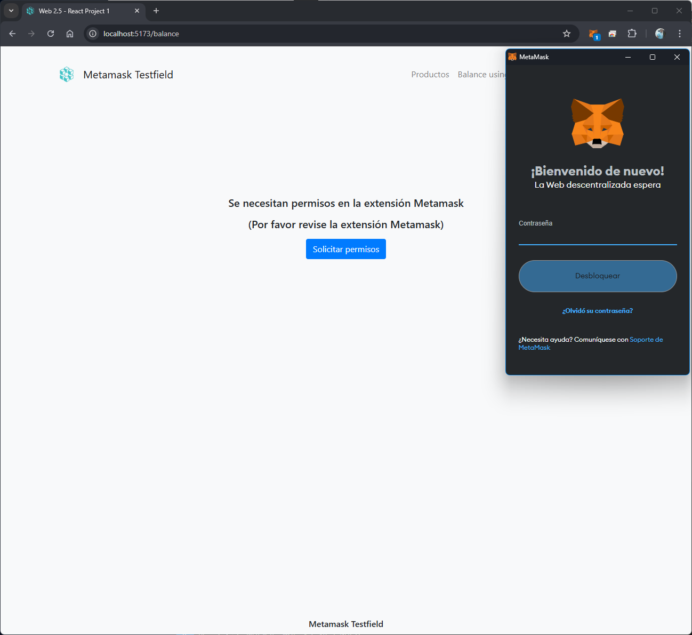
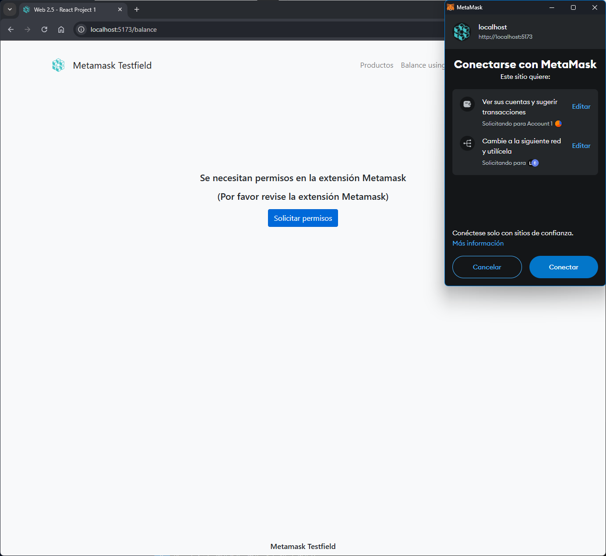
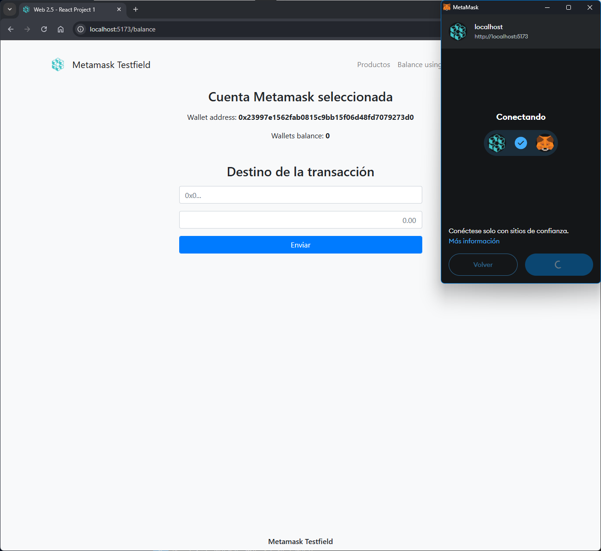
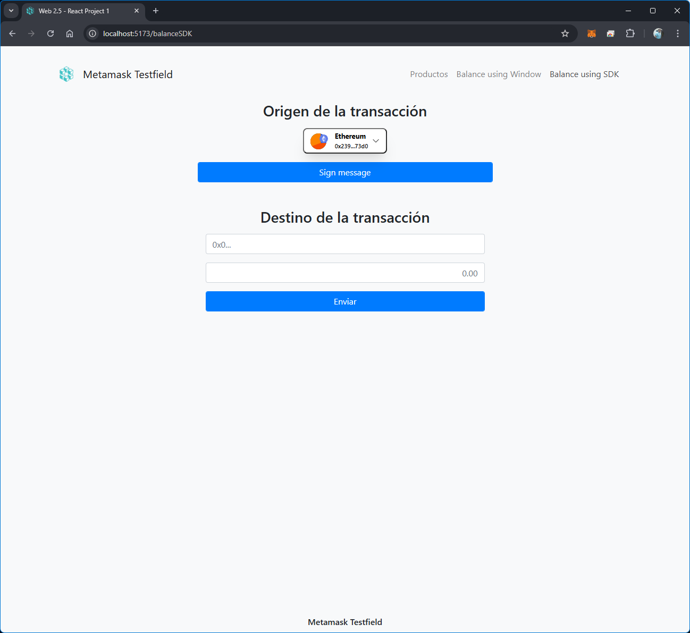

# React + TypeScript + Vite + DB + Metamask

### On this small project is implemented:
- How to get basic data from DB using [dummyjson](https://dummyjson.com)
- How to connect with a wallet using Metamask Chrome extension
  - How to get wallet balance
  - How to do a transacction

### Installation and running the project
You can check how it works using: 
```bash
  npm install
  npm run dev
```

### Metamask Wallet connection
Once you start the project, visit http://localhost:5173/balance (by default) and you will see how it attemps to use Metamask extension:

1st you have to enter your Metamask password: 



One you enter your password, you will be asked for permissions: 



Then you will be granted to select and use your wallet: 



You can also use the last navbar link to see the same proccess using the Metamask SDK: 



